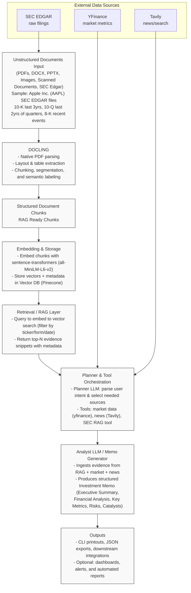

# Finance Research Analyst Agent

An intelligent document-processing and research agent that automates extraction, retrieval, and analysis of financial information from unstructured documents (SEC filings, PDFs, presentations, scanned documents) and public-market data to generate actionable investment memos.

This repository contains the core orchestration, lightweight RAG (retrieval-augmented generation) tools, and examples used to:

- Ingest and semantically index filings and documents (10-K, 10-Q, 8-K, reports)
- Store embeddings in a vector index (Pinecone) for fast, metadata-filtered retrieval
- Orchestrate LLM planning and analyst flows to create structured investment memos
- Fetch market and news data (yfinance, Tavily) and combine with SEC context

## Key features

- Document-to-structured-data pipeline (chunking, embeddings, metadata)
- RAG-powered SEC context retrieval for evidence-backed analysis
- Planner agent that decides which data sources to call (SEC, market, news)
- Analyst agent that synthesizes gathered context into an Investment Memo model
- Example CLI-driven interactive loop for rapid experimentation

## Architecture (high-level)

Below is a technical flow diagram that visualizes the pipeline end-to-end. It highlights which components operate on documents, which store and index embeddings, where retrieval happens, and where LLM planning and analysis occur.


┌─────────────────────────────────────────────────────────────────┐
│              Unstructured Documents Input                       │
│    (PDFs, DOCX, PPTX, Images, Scanned Documents, SEC Edgar)     |
|      Sample used for MVP: Apple Inc. (AAPL) SEC EDGAR files     |
|   10-K last 3yrs, 10-Q last 2yrs of quarters, 8-k recent events │
└────────────────────┬────────────────────────────────────────────┘
                     │
                     ▼
┌─────────────────────────────────────────────────────────────────┐
│                      DOCLING.                                   │
│    • Native PDF parsing                                         │
│    • Layout & table extraction                                  │
│    • Chunking, segmentation, and semantic labeling              │
└────────────────────┬────────────────────────────────────────────┘
                     │
                     ▼
┌─────────────────────────────────────────────────────────────────┐
│               STRUCTURED DOCUMENT CHUNKS                        │
│                   RAG Ready Chunks                              │
└────────────────────┬────────────────────────────────────────────┘
                     │
                     ▼
┌─────────────────────────────────────────────────────────────────┐
│                      EMBEDDING & STORAGE                         │
│    • Embed chunks with sentence-transformers(all-MiniLM-L6-v2)  │
│    • Store vectors + metadata in Vector DB (Pinecone)            │
└────────────────────┬────────────────────────────────────────────┘
                     │
                     ▼
┌─────────────────────────────────────────────────────────────────┐
│                   RETRIEVAL / RAG LAYER                          │
│    • Query → embed → vector search (filter by ticker/form/date)  │
│    • Return top-N evidence snippets with metadata                │
└────────────────────┬────────────────────────────────────────────┘
                     │
                     ▼
┌─────────────────────────────────────────────────────────────────┐
│                 PLANNER & TOOL ORCHESTRATION                      │
│    • Planner LLM: parse user intent & select needed sources      │
│    • Tools: market data (yfinance), news (Tavily), SEC RAG tool   │
└────────────────────┬────────────────────────────────────────────┘
                     │
                     ▼
┌─────────────────────────────────────────────────────────────────┐
│               ANALYST LLM / MEMO GENERATOR                      │
│    • Ingests evidence from RAG + market + news                  │
│    • Produces structured Investment Memo (Executive Summary,    │
│      Financial Analysis, Key Metrics, Risks, Catalysts)         │
└────────────────────┬────────────────────────────────────────────┘
                     │
                     ▼
┌─────────────────────────────────────────────────────────────────┐
│                         OUTPUTS                                 │
│    • CLI printouts, JSON exports, downstream integrations       │
│    • Optional: dashboards, alerts, and automated reports        │
└─────────────────────────────────────────────────────────────────┘



Quick numbered steps for the same flow:

1. Input: unstructured documents (PDF, DOCX, HTML filings)
2. Doc processing: chunk, normalize, produce text chunks with metadata
3. Embedding: encode chunks with a sentence-transformer model
4. Vector store: store embeddings and metadata in Pinecone
5. Planner LLM: decide which data sources are needed for a user request
6. Data gatherers: fetch SEC snippets (RAG), market metrics (yfinance), news (Tavily)
7. Analyst LLM: synthesize evidence into a structured Investment Memo
8. Output: CLI/JSON/memo printout or downstream integration

## Quick start

These instructions assume you have Python 3.10+ and a virtual environment.

1. Create and activate a virtual environment (macOS / zsh):

```bash
python -m venv .venv
source .venv/bin/activate
```

2. Install dependencies:

```bash
pip install -r requirements.txt
```

3. Create a `.env` file in the project root and add the required keys:

```
OPENAI_API_KEY=sk-...
PINECONE_API_KEY=pcsk-...
TAVILY_API_KEY=tvly-...
```

4. Run an example script (the repo provides `main.py` and `memo.py`):

```bash
python main.py
```

Or run the interactive memo generator in `memo.py`:

```bash
python memo.py
```

Note: some scripts rely on external services (OpenAI/Tavily/Pinecone). Ensure network access and valid API keys.

## Files of interest

- `main.py` — example agent and tools (stock analysis, SEC RAG tool, Tavily news tool)
- `memo.py` — full investment-memo orchestration with Planner and Analyst agents
- `secEdgar_downloader.py` — (if present) tools to fetch filings locally
- `rag_knowledge_base/` — prebuilt index and JSON summaries used for testing
- `requirements.txt` — Python dependencies

## Environment variables and configuration

The repo expects the following environment variables (at minimum):

- `OPENAI_API_KEY` — API key for OpenAI-compatible LLMs (used by pydantic_ai Agents)
- `PINECONE_API_KEY` — API key to connect to Pinecone vector DB
- `TAVILY_API_KEY` — API key for Tavily news/search tool

Optional tuning/config values are found inline in `main.py` / `memo.py`, such as:

- `INDEX_NAME` — Pinecone index name (default `sec-rag` in examples)
- `EMBEDDING_MODEL` — sentence-transformers model used for embeddings

If you use a different vector DB or embedding model, update the code where the Pinecone client or SentenceTransformer is initialized.

## Usage examples

- Generate a stock analysis with SEC context (example in `main.py`):

    - The `stock_agent` shows how to call `get_sec_context`, `get_stock_data`, and `get_recent_news` as tools.

- Generate a full investment memo (example in `memo.py`):

    - Launch `memo.py` and try prompts such as:
        - "Give me a comprehensive investment analysis of Apple Inc"
        - "What's the latest news and market sentiment on Tesla?"

## Development notes

- The code uses `pydantic_ai.Agent` to wrap LLMs and tool functions. Tools are usually annotated with `@agent.tool_plain` or called directly from orchestration functions.
- RAG: Pinecone stores metadata per chunk such as `ticker`, `form_type`, `section`, `text`. Queries filter by `ticker` and use embedding similarity to find evidence snippets.
- For local testing you can include a small subset of the knowledge base in `rag_knowledge_base/` and point the Pinecone queries to a mock or local vector index.

## Testing and validation

- There are no automated tests in the repo by default. For the code you modify, a minimal approach:
    1. Create a small test that calls `get_sec_context` with a sample query and asserts a list is returned.
    2. Mock external API clients (Tavily, Pinecone, yfinance) in unit tests.

## Troubleshooting

- Pinecone errors: verify `PINECONE_API_KEY` and `INDEX_NAME`, ensure index exists and metadata fields match expectations.
- Tavily errors: confirm `TAVILY_API_KEY` and that the project has access to the news/search endpoints used.
- OpenAI/LLM errors: ensure `OPENAI_API_KEY` is present and usage limits are not exceeded.
- yfinance returns empty values: yfinance can sometimes return incomplete `info`; use small fallbacks in code or call `.history()` for time-series checks.

## Security and privacy

- Do not commit API keys. Use `.env` for local development and secrets managers for production.
- When sending user data to LLMs or third-party APIs, ensure compliance with your organization's data policy.

## Contributing

Contributions are welcome. Typical workflow:

1. Fork the repo and create a feature branch.
2. Add tests for new functionality and run them locally.
3. Open a pull request with a clear description of changes.

If you want specific formatting or extra sections (badges, license, CoC), tell me and I’ll add them.

## License

This repository does not include a license file by default. Add a `LICENSE` file (e.g., MIT) if you want to make it open source.

## Contact

For questions or integration help, open an issue or contact the repository owner.

---

README last updated: 2025-10-31

