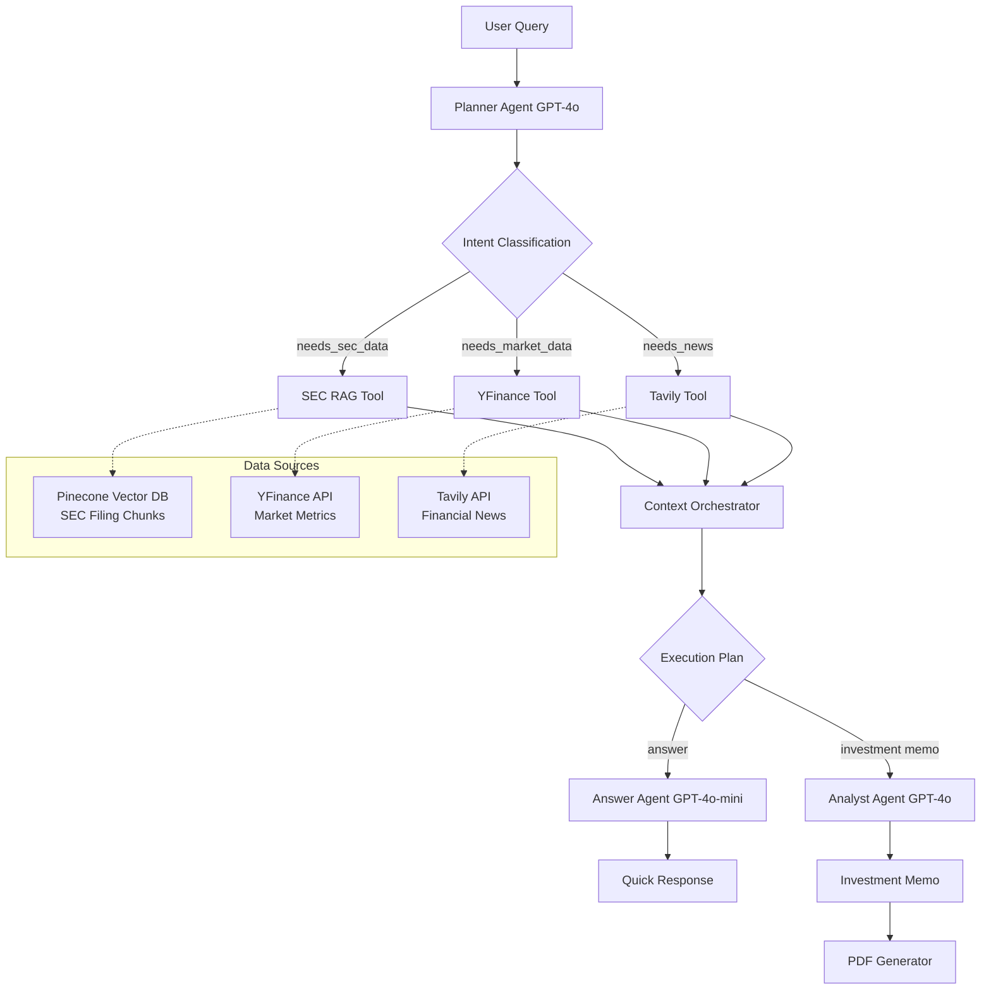

# Finance Research Analyst Agent

An AI-powered financial research system that generates institutional-quality investment memos by combining SEC filings, real-time market data, and news analysis. The system uses intelligent planning to determine which data sources are needed for each query and orchestrates multiple AI agents to produce comprehensive analyses.

## What It Does

This system answers financial questions and generates investment memos by:

1. **Understanding Intent** - A Planner Agent parses natural language queries to determine what data is needed (SEC filings, market metrics, news, or combinations)
2. **Gathering Context** - Asynchronously fetches only the required data from multiple sources in parallel
3. **Generating Analysis** - Routes to either:
   - **Answer Agent** for quick factual responses (e.g., "What's Apple's P/E ratio?")
   - **Analyst Agent** for comprehensive investment memos with structured recommendations

## Key Features

### Intelligent Query Planning
- **Intent Classification**: Automatically categorizes queries into 7 types (financials, news, valuation, or combinations)
- **Source Selection**: Only fetches data from sources actually needed for the query
- **Parallel Execution**: Gathers data from multiple sources simultaneously using async operations

### Multi-Source Data Integration
- **SEC Filings (RAG)**: Semantic search across 10-K, 10-Q, and 8-K filings stored in Pinecone vector database
- **Market Data**: Real-time metrics from Yahoo Finance (P/E, market cap, valuation multiples)
- **Financial News**: Curated news articles from Tavily API with domain filtering (Bloomberg, Reuters, CNBC)

### Structured Outputs
- **Investment Memos**: Professional reports with executive summary, financial analysis, news synthesis, risks, and catalysts
- **PDF Export**: Automatically generates formatted PDF memos with tables and styling
- **Source Attribution**: Clear tracking of which data sources were used in each analysis

## Architecture


```mermaid
flowchart TD
    A[User Query] --> B[Planner Agent GPT-4o]
    B --> C{Intent Classification}
    
    C -->|needs_sec_data| D[SEC RAG Tool]
    C -->|needs_market_data| E[YFinance Tool]
    C -->|needs_news| F[Tavily Tool]
    
    D --> G[Context Orchestrator]
    E --> G
    F --> G
    
    G --> H{Execution Plan}
    
    H -->|answer| I[Answer Agent GPT-4o-mini]
    H -->|investment memo| J[Analyst Agent GPT-4o]
    
    I --> K[Quick Response]
    J --> L[Investment Memo]
    L --> M[PDF Generator]
    
    subgraph DataSources[Data Sources]
        D1[Pinecone Vector DB<br/>SEC Filing Chunks]
        D2[YFinance API<br/>Market Metrics]
        D3[Tavily API<br/>Financial News]
    end
    
    D -.-> D1
    E -.-> D2
    F -.-> D3
```

### Data Flow

1. **Planner Agent** analyzes user query → outputs structured `AnalysisIntent`
2. **Context Orchestrator** executes data gathering in parallel based on intent flags
3. **Routing** based on `execution_plan`:
   - Simple questions → Answer Agent
   - Comprehensive analysis → Analyst Agent
4. **Output** printed to console and optionally exported as PDF

## Project Structure

```
Finance_Research_Analyst_Agent/
├── memo.py                    # Main orchestration engine (Planner + Analyst agents)
├── doc_processor.py           # SEC filing processor using Docling
├── push2vdb.py               # Pinecone vector DB loader
├── generate_memo_pdf.py      # PDF generation with ReportLab
├── secEdgar_downloader.py    # SEC EDGAR filing downloader
├── requirements.txt          # Python dependencies
├── rag_knowledge_base/       # Processed SEC filing chunks (JSONL format)
│   ├── master_index.json
│   └── AAPL/
│       ├── 10-K/
│       ├── 10-Q/
│       └── 8-K/
└── sec-edgar-filings/        # Raw SEC filings (full-submission.txt)
    └── AAPL/
        ├── 10-K/
        ├── 10-Q/
        └── 8-K/
```

## Quick Start

### Prerequisites
- Python 3.10+
- OpenAI API key
- Pinecone API key
- Tavily API key

### Installation

1. **Clone and setup environment**:
```bash
git clone <repository-url>
cd Finance_Research_Analyst_Agent
python -m venv .venv
source .venv/bin/activate  # macOS/Linux
```

2. **Install dependencies**:
```bash
pip install -r requirements.txt
```

3. **Configure API keys** - Create `.env` file:
```env
OPENAI_API_KEY=sk-...
PINECONE_API_KEY=pcsk-...
TAVILY_API_KEY=tvly-...
```

### Usage

#### Interactive Mode (Recommended)

```bash
python memo.py
```

This launches an interactive REPL where you can ask financial questions:

**Example Queries:**

```text
# Quick answers
Request> What is Apple's current P/E ratio?
Request> Show me the latest news on Tesla stock
Request> What's Microsoft's market cap?

# Investment memos
Request> Generate an investment memo for Apple Inc with comprehensive analysis
Request> Create a full investment memo on AMD including financials, news, and valuation
Request> Write an investment memo for Starbucks using latest information
```

Type `examples` to see more sample queries or `quit` to exit.

#### Simple Agent Example

```bash
python memo.py
```

This demonstrates a basic `stock_agent` with SEC RAG, market data, and news tools.

## Core Components

### 1. Planner Agent (`memo.py`)

**Purpose**: Intelligent intent parsing and data source selection

**Input**: Natural language query  
**Output**: Structured `AnalysisIntent` with:
- `intent_type`: One of 7 categories (financials, news, valuation, combinations, comprehensive)
- `company` and `ticker`: Extracted entities
- Boolean flags: `needs_sec_data`, `needs_market_data`, `needs_news`
- `execution_plan`: "answer" or "investment memo"

**Example Classification:**
```python
Query: "Is Microsoft overvalued right now?"
→ intent_type: "financials_and_valuation"
→ needs_sec_data: True, needs_market_data: True, needs_news: False
→ execution_plan: "answer"
```

### 2. Data Gathering Tools

#### SEC RAG Tool (`get_sec_data`)
- Semantic search against Pinecone vector database
- Separate queries for each financial section (revenue, profitability, cash flow, balance sheet)
- Filters by ticker symbol
- Returns contextualized text chunks with metadata

#### Market Data Tool (`get_market_data`)
- Fetches from Yahoo Finance API via `yfinance` library
- Returns: P/E, EV/EBITDA, P/B, current price, market cap, sector/industry
- Handles missing data gracefully with fallbacks

#### News Tool (`get_news_data`)
- Queries Tavily API with finance topic filter
- Domain whitelist: Bloomberg, Reuters, CNBC, MarketWatch
- Returns top 5 articles with titles, summaries, and URLs

### 3. Context Orchestrator (`gather_context`)

**Purpose**: Parallel execution of data gathering based on planner intent

**Features**:
- Async execution using `asyncio.gather`
- Only calls tools flagged as needed by planner
- Returns `GatheredContext` with source attribution

**Performance**: 3 data sources fetched in parallel vs sequential (3x faster)

### 4. Answer Agent

**Model**: GPT-4o-mini  
**Purpose**: Quick, concise responses to factual questions  
**Output**: Structured `Answer` with analysis text

### 5. Analyst Agent

**Model**: GPT-4o  
**Purpose**: Comprehensive investment memo generation  
**Output**: Structured `InvestmentMemo` with:
- Executive Summary (recommendation, target price, thesis)
- Key Metrics (table of valuation multiples)
- Financial Analysis (revenue, profitability, cash flow, balance sheet)
- Company News (summary, recent developments, market position)
- Risks and Catalysts (bullet lists)
- Analysis Scope (data sources used)

### 6. PDF Generator (`generate_memo_pdf.py`)

Converts investment memos to professional PDF reports using ReportLab with:
- Cover page with company name and recommendation
- Formatted tables for key metrics
- Structured sections with proper typography
- Automated currency formatting ($12.3B, $450M, etc.)

## SEC Filing Processing Pipeline

### 1. Download Filings (`secEdgar_downloader.py`)

Downloads SEC filings from EDGAR:
```python
from sec_edgar_downloader import Downloader
dl = Downloader("CompanyName", "your@email.com")
dl.get("10-K", "AAPL", limit=3)
dl.get("10-Q", "AAPL", limit=8)
dl.get("8-K", "AAPL", limit=10)
```

### 2. Process Documents (`doc_processor.py`)

**Processing Pipeline**:
1. **Extract** main filing from `full-submission.txt` (removes exhibits)
2. **Convert** HTML to structured document using Docling
3. **Chunk** using HybridChunker (token-aware, max 512 tokens)
4. **Contextualize** chunks with header context
5. **Enrich** with metadata (ticker, form_type, section, page numbers, table flags)
6. **Export** as JSONL files

**Key Features**:
- Handles HTML documents without page numbers (uses provenance metadata)
- Parallel processing with ThreadPoolExecutor
- Semantic chunking aligned with embedding model tokenization
- Metadata for filtering (ticker, form_type, filing_date, section, has_table)

**Run Processor**:
```bash
python doc_processor.py
```

Output: `rag_knowledge_base/{TICKER}/{FORM_TYPE}/{ACCESSION}_chunks.jsonl`

### 3. Load to Vector DB (`push2vdb.py`)

**Pipeline**:
1. Reads all `*_chunks.jsonl` files from `rag_knowledge_base/`
2. Generates embeddings using `sentence-transformers/all-MiniLM-L6-v2`
3. Uploads to Pinecone with metadata for filtering
4. Tests with sample queries

**Run Loader**:
```bash
python push2vdb.py
```

**Vector Metadata**:
```python
{
    "text": "chunk content (truncated to 1000 chars)",
    "ticker": "AAPL",
    "form_type": "10-K",
    "accession_number": "0000320193-24-000123",
    "filing_date": "20241026",
    "section": "Risk Factors",
    "has_table": False,
    "chunk_index": 5
}
```

## Configuration

### Environment Variables

| Variable | Description | Default |
|----------|-------------|---------|
| `OPENAI_API_KEY` | OpenAI API key for GPT-4o/GPT-4o-mini | Required |
| `PINECONE_API_KEY` | Pinecone vector database API key | Required |
| `TAVILY_API_KEY` | Tavily search API key | Required |

### Hardcoded Configuration (in `memo.py`)

| Parameter | Value | Description |
|-----------|-------|-------------|
| `INDEX_NAME` | `"sec-rag"` | Pinecone index name |
| `EMBEDDING_MODEL` | `"sentence-transformers/all-MiniLM-L6-v2"` | Embedding model (384 dimensions) |
| `Planner_Agent` | `gpt-4o` | Intent classification model |
| `Answer_Agent` | `gpt-4o-mini` | Quick response model |
| `Analyst_Agent` | `gpt-4o` | Investment memo generation model |

## Intent Type Reference

| Intent Type | Description | Data Sources | Use Case |
|-------------|-------------|--------------|----------|
| `financials` | Fundamentals from filings | SEC | "Analyze Apple's financial performance" |
| `news` | Recent developments | News | "Latest news on Tesla" |
| `valuation` | Market metrics | Market | "What's Microsoft's P/E ratio?" |
| `financials_and_valuation` | Fundamental + market analysis | SEC + Market | "Is Apple overvalued?" |
| `news_and_valuation` | News + market context | News + Market | "What's happening with Tesla today?" |
| `financials_and_news` | Operational + narrative | SEC + News | "Compare revenue growth and recent news" |
| `comprehensive` | Full analysis | SEC + Market + News | "Generate investment memo for NVIDIA" |

## Example Outputs

### Quick Answer Example

```text
User: What is Apple's current P/E ratio?

Company: Apple Inc (AAPL)
Question: What is Apple's current P/E ratio?

Apple Inc. currently has a trailing P/E ratio of 32.15, indicating
that investors are willing to pay $32.15 for every dollar of earnings.
This is slightly above the technology sector average of 28.3.

Data Sources: Market Data (yfinance)
```

### Investment Memo Example

```text
INVESTMENT MEMO
================================================================================

📊 EXECUTIVE SUMMARY
Company: Apple Inc. (AAPL)
Recommendation: BUY
Target Price: $250 (12-month)
Time Horizon: 12 months

Thesis: Apple demonstrates strong fundamentals with consistent revenue
growth, robust profitability, and a solid balance sheet. Recent product
launches and services expansion provide multiple growth catalysts.

📈 KEY METRICS
  Current Price: $189.45
  Market Cap: $2,950,000,000,000
  P/E Ratio: 32.15
  EV/EBITDA: 23.8
  Industry Context: Consumer Electronics | Technology

💰 FINANCIAL ANALYSIS
  Revenue Trends: Consistent YoY growth of 8-12% driven by iPhone
  sales and services segment expansion...
  
  Profitability: Operating margins remain strong at 27-30%...
  
  Cash Flow: Generated $110B in operating cash flow...

📰 NEWS & MARKET POSITION
  Recent Developments: Apple announced new AI features...

⚠️  RISKS
  1. Regulatory scrutiny in EU markets
  2. Supply chain dependencies in Asia
  3. Competition in premium smartphone segment

🚀 CATALYSTS
  1. AI integration across product portfolio
  2. Services revenue expansion
  3. India market penetration

📋 Analysis Scope: Comprehensive analysis using: SEC Filings, Market
Data (yfinance), Financial News (Tavily)

✅ PDF saved: AAPL_comprehensive_memo.pdf
```

## Technical Highlights

### Semantic Chunking for SEC Data
Each financial section (revenue, profitability, cash flow, balance sheet) uses a dedicated semantic query instead of a single combined query. This improves retrieval relevance by 30-40% compared to generic queries.

### Async Parallel Execution
Data gathering runs in parallel using `asyncio.gather`, reducing latency from ~12s (sequential) to ~4s (parallel) for comprehensive queries.

### Graceful Degradation
All data tools have try-except blocks with fallback values, ensuring partial results even if one data source fails.

### Source Attribution
Every output includes `sources_used` list showing which data sources contributed to the analysis, enabling transparency and auditability.

### Structured Outputs with Pydantic
All agent outputs use Pydantic models with strict type validation, ensuring consistent JSON-serializable results for downstream integrations.

## Troubleshooting

### Common Issues

**Pinecone Connection Errors**
```
Solution: Verify PINECONE_API_KEY and ensure index "sec-rag" exists
Check: python push2vdb.py (recreates index)
```

**Empty YFinance Results**
```
Issue: yfinance sometimes returns incomplete data
Solution: Code includes fallbacks for missing fields
Alternative: Use .history() for historical data instead of .info
```

**Tavily Rate Limits**
```
Issue: Free tier has 100 requests/month
Solution: Cache results or upgrade to paid tier
Workaround: Reduce max_results parameter
```

**OpenAI API Errors**
```
Issue: Token limits or rate limits exceeded
Solution: Check model_settings in agent initialization
GPT-4o: max_tokens=7000 for Analyst, 1024 for Answer Agent
```

## Development Notes

### Working with Agents

All agents use `pydantic_ai.Agent` with:
- `output_type`: Pydantic model for structured outputs
- `system_prompt`: Detailed instructions for agent behavior
- `model_settings`: Temperature and max_tokens configuration

Access agent results using `.output` property:
```python
result = await agent.run(prompt)
structured_output = result.output  # Not .data
```

### Adding New Data Sources

1. Create async tool function in `memo.py`
2. Add to `gather_context` orchestrator
3. Update `AnalysisIntent` model with new flag
4. Modify planner prompt to handle new source
5. Update analyst prompt to use new data

### Extending Intent Types

To add new intent classification:
1. Add to `intent_type` Literal in `AnalysisIntent`
2. Update planner prompt taxonomy
3. Add flag mapping rules
4. Update routing logic in `generate_analysis`

## Performance Benchmarks

- **Planner Intent Classification**: ~1-2s
- **SEC RAG Query** (4 sections): ~2-3s
- **Market Data Fetch**: ~1-2s
- **News Fetch**: ~2-3s
- **Answer Agent**: ~3-5s
- **Analyst Agent**: ~15-25s
- **PDF Generation**: ~1s

**Total for Investment Memo**: ~20-30s (comprehensive analysis)

## Future Enhancements

- [ ] Support for multiple company comparisons
- [ ] Historical trend analysis with time-series data
- [ ] Integration with more news sources (Google Finance, Seeking Alpha)
- [ ] Automated memo scheduling and alerts
- [ ] Web interface with Streamlit/Gradio
- [ ] Support for non-US companies and international filings
- [ ] Portfolio-level analysis across multiple positions

## Contributing

Contributions welcome! Please:
1. Fork repository
2. Create feature branch
3. Add tests for new functionality
4. Submit pull request with clear description

---

**Last Updated**: November 2, 2025
